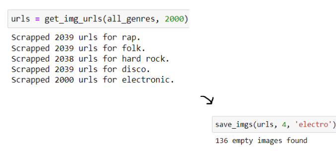
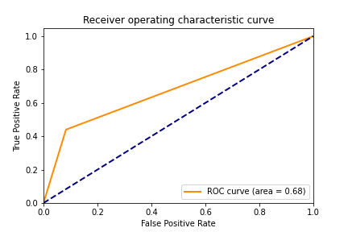
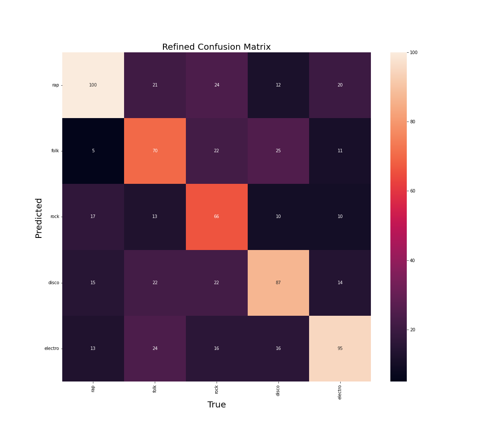
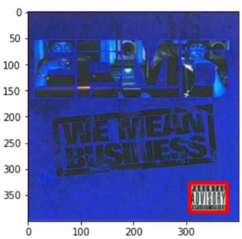

# Music-Genre-Classification-via-Album-Cover
This project was created to explore machine learning models' capabilities of finding patterns in human-made art, such as album cover VS corresponding music genre. 
&nbsp;

_The dataset can be found [on Kaggle](https://www.kaggle.com/datasets/anastasiapetrunia/album-covers-dataset)._

### Table of content
[Data Collection](#data-collection)
&nbsp;

[Research and Approach Selection](#research-and-approach-selection)
&nbsp;

[Models and Results](#models-and-results)

## Data Collection
As this project was a final project at Data Science Summer Camp, it had some requirements. 

1. Music genres: rap, folk, hard rock, disco, and electronic music.
2. Years: 2000-2022

So the data was collected from [AllMusic Advanced Search](https://www.allmusic.com/advanced-search) using Selenium. 
&nbsp;

&nbsp;

As a result, we got a dataset consisting of:
- Rap - 1853 imgs
- Folk - 1900 imgs
- Hard Rock - 1911 imgs
- Disco - 1783 imgs
- Electronic music - 1864 imgs

[Notebook](Data-Collection-Using-Selenium.ipynb) with Selenium scrapper.
## Research and Approach Selection
Before actually trying to implement models, I did a research on similar projects, their data analysis, approaches, model selection, and results. 
&nbsp;

[Visual Metaphors on Album Covers](https://ir.library.oregonstate.edu/concern/honors_college_theses/0r967b03c) paper by Vivian Le showes, that there is, indeed, a distinguishable correlation between music genres and album covers. Researchers conducted a lab experiment, randomly exposing participants to 10 images of album art, one at a time, from total selection of 20 albums. The selected album covers included four albums from each of the five genres: Hip-Hop/R&B, Rock/Alternative, Pop, Country, and Electronic. 
>If there was truly no relationship between the album cover and its genre, there should only be correct assessment of an album genre about 20% of the time. However, participants were able to correctly assess the genre about 58% of the time. This suggests that there are factors that people use in order to assess the genre of an album.
&nbsp;

Some of the studies were doing data analysis such as color analysis of the album cover, is there a person (singer) on the cover etc. Object detection was selected as one of the approaches to analyse data and, maybe, improve future model.

## Models and Results
As I don't have that much data to traing a model from scratch, I decided to use transfer learning. I used ResNet101, frozen last two layers and added two Dense layers. I used Adam as an optimizer with Sparse Categorical Cross Entropy (as the labels were not one-hot encoded). Performance on the test set was measured using area under the ROC curve, Precision, Recall and Accuracy. 
&nbsp;

Accuracy on the test set was 0.557, which is pretty similar to a previously mentioned lab experiment's result. Area under the ROC curve was 0.68, Precision and Recall were 0.57 and 0.56 respectively. 
&nbsp;

&nbsp;

Confusion Matrix:

&nbsp;

In addition to the main model two other approaches were applied to the problem. A specific feature could also help in building a better-performed algorithm.
&nbsp;

The Parental Advisory label was started by a political group in the 1980s called the Parents Music Resource Center (PMRC). It was intended for parents to be aware of possibly violent or in any way unacceptable for the younger audience lyrics. This label was never mandatory, so an artist could decide whether to put it on their album cover or not. But it got very popular with Rap artists in particular, although Rock music tend to have "Explicit Content" as well.
&nbsp;

While examining data visually, I notised that most of the Rap album covers actually have the Parental Advisory label, whereas there are only two Rock album covers containing same label, and zero album covers contain this label for the rest of the considered genres. This should be notised with our model as an excellent feature to detect Rap genre album covers. And it migth be the case, if we look at the results of our model, as Rap is predicted the best out of all genres. But looking at some misclassiffied album covers I saw that the model doesn't always recognize the label. So I decided to build an object detection model using SSD MobileNet V2 FPNLite (320x320). 
&nbsp;

&nbsp;

Now it's possible to alter the outcome of the model if it has the Parental Advisory label, and make it more accurate.
&nbsp;

Besides, as was mentioned in [Research and Approach Selection](#research-and-approach-selection) I tried to analyse possible correlations between the objects that appear on album covers and selected genres. To do so I used [Clarifai API](https://github.com/Clarifai/clarifai-python-grpc/) and a 1000 imgs per class. Then i filtered the objects, that appeared in less than 20% of the images and analyzed results. This can be also used in tuning the model's predictions a bit. 
## Conclusion and Future Work
Different studies on the topic of classifying album covers by their music genre show that it is possible to build a model that can perform well on such task. All of the approaches that were tried in this project could be combined in one algorithm to provide the best possible predictions. Also future research colud be done to enhance the obtained results.
